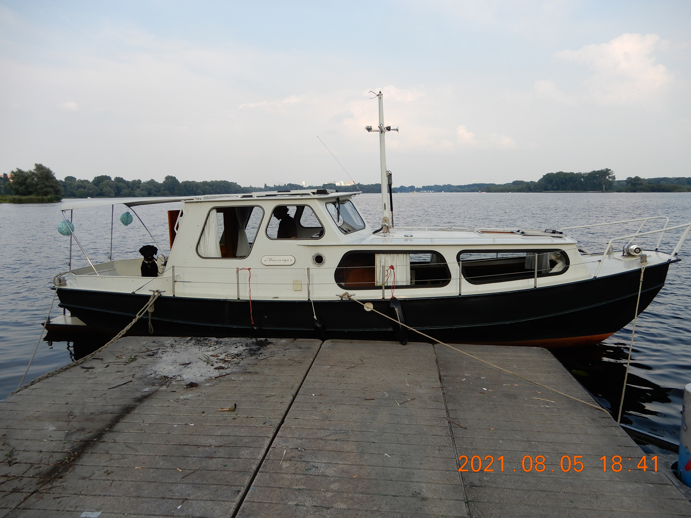

# Waer en Wyn

Waer en Wyn is a boat, this repo is about logging related issues.

## BASIC CHARACTERISTICS

[Original advertisement](https://www.heeresloot.nl/en/offer/191561/motor-schouw-ok/)

 - length: 8.8m
 - width: 2.5
 - air draft: 2.1m
 - draft: 70cm

## Engine: Mercedes OM615, 40hp, liquid cooled, inboard diesel engine (common in W123 cars)

Serial numbers on the engine:

- 615.917-10-082448
- 615 01118 01

FIXME: *could not find the manual yet!*

Additional links:

- http://www.hanomag-henschel.net/mercedes-benz/motoren/om615-917/
- http://www.truckstar.com.ua/fullmengen_t2alt_en.php?vin=
- https://nl.wikipedia.org/wiki/Mercedes-Benz_OM615
- https://en.wikipedia.org/wiki/Mercedes-Benz_OM615_engine
- https://en.wikipedia.org/wiki/Unimog_421

## Bow thruster: 3.1kW (manual available)

## Solar panels: 2x80W Victron

## Charge controller: Victron BlueSolar 12/24V-20A SCC010530100 (?)

## Batteries: 2x Victron 12V 220Ah AGM Deep Cycle Battery + 1x smaller one for bow thruster (FIXME)

## Gearbox

ZF25 or HBW250R

## Name

"Waer en Wyn" is in a Frisian dialect, and appears in [this](https://nl.wikipedia.org/wiki/De_Slikwerker) poem on a statue. 
